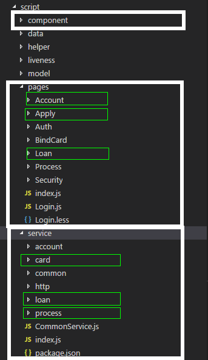
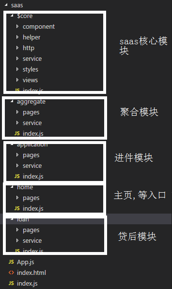

# saas 模块化组件设计
### 目录
   1. <a href="#q">问题</a>
   2. <a href="#s">思路</a>
   3. <a href="#d">设计</a>

### 1: <a name="#q">问题</a> - 块化遇到的问题

##### 1.1, 组件的样式无法覆盖,也即后续无法通过简单的样式css修改

如果组件使用了css-module的技术，将样式的作用域从全局的变成只有组件作用域的，那么我们的组件在以后的场景中并不能提供给调用者很好的扩展。
    - 这里其实是一个规范和自由的权衡考虑，
    - 如果组件是场景固定或者不依赖于客户的，那么可以考虑css-module。 将样式添加到组件作用域。
     如果考虑到后续会依赖于客户，那么css-module就会出现限制或禁锢的感觉。
    - @welab-xlib-component和早期saas项目设计采用了css-module技术.
    
saas项目已经去掉了css-module, 根据各种开源的项目的实现选择了大家基本上遵守的规范来定义组件的样式。
>由:
        >> 所有的组件样式都有一个命名空间,将命名空间前缀在组件的根节点属性,
        `.saas-button`, `.saas-input` 
        >> . 命名空间设计成只需要修改一处，所有的组件都可以改变,例如后续可能
       命名为 welab-saas-button,  jdd-saas-button.都可以简单的修改
       一处即可。


##### 1.2. 模块的边界

  一般的前端项目，划分比较细的会有类似`MVC`的目录结构。
  - 类似ng, 会有controller, service, view 等概念。
  - 那么针对saas前端的特性以及需求如何划分模块与文件夹结构去适应后续的扩展以及重构的可持续性。
  
##### 1.3: 动态渲染的组件的要求.
   - 为了满足于可配置生成特定场景的需求来开发了基于react的动态渲染组件技术。
   - 可配置动态渲染组件是组件是由一个`json`对象来生成的。可以是一个`json`文件或者是一个`http`接口返回的`json`对象。
   - 组件输入的值要求能够提供验证规则.
  

### <a name="#s">2.思路</a>

1. 面向对象的思想, 用es6的class, extends 概念.
   面向切面的思想, 用mixin 混合概念.
2. 借鉴后端微服务的概念,来划分模块和目录 micro service
3. 组件的规范和可扩展,及动态渲染. standard
4. 高阶组件. High Order Component 
6. 延迟加载组件.Lazy Load Component

### <a name="#p">3. 设计</a>

#### 3.1 借鉴微服务来划分目录和模块

##### 第一次设计的目录.


##### 熟悉简单业务之后的目录




这里可以看到我们划分出了5个模块,
- $core,   `@saas-core`模块,
- home,    `@saas-home`入口首页等模块
- application, `@saas-application` 进件模块
- loan,        `@saas-loan`贷后模块
- aggreate     `@saas-aggreate`聚合模块(绑卡，auth, pay)

并借鉴后端的微服务来重新设计模块， 将上述5个模块提升为一级目录，并且相互独立开。除了`$core`模块之外，其他四个模块没有依赖关系。
每个模块都可以在将来重构为独立部署，独立开发。因为模块的界限已经相对清晰起来，业务模块只依赖`$core`模块。
* 我们同时也设计了文件的导入方法，从以前的
    ```javascript
      import Button from './../../component/button'
    ```
    改变为
    ```javascript
        import Button from @saas-core/component;
        //...
        import $http from '@saas-core/http';
        //...
        import LoanService from '@saas-loan/service'
    ```
* 统一以`@saas-core`,`@saas-application`,`@saas-loan`,`@saas-home`,`@saas-aggreate`来作为导入的root路径，不在以文件夹的相对路径来导入模块。

    
模块和目录确定之后，在打包编译脚本中重构以适应变化。每个模块都有一个index.js, 这个index.js就是将来模块独立部署的入口文件。

当前目录和模块即适应目前现状，还未完全精通业务，还未完全开发出来的情况。
不会因为业务的增加而调整文件结构而造成的工作量增加。
也为将来的模块独立应用提供基础。


#### 3. 组件的规范，可扩展， 动态渲染.

为了满足组件可以配置化生成，需要定义出一些组件规范
组件必需属性和方法:
- method:

    `setValue`, 
    `getValue`
- property:
    
    `标识fieldId`,
    `验证规则code`,
    `css类className`,
     `样式style`,
     `扩展属性`
     
动态渲染组件需要
-[1]. 后端的字段列表

#### 高阶组件和延迟加载组件.
* 延迟加载组件: 当获取到后端接口返回显示的组件时,再加载组件.
```javascript
// 组件map
const map = {
    Button: () => import(/*webpackChunkName: 'dynamicComp' */'@saas-core/component/Button'),
    Input: () => import(/*webpackChunkName:'dynamicComp'*/'@saas-core/component/Input')
    // .....
}
// 后端接口返回的组件列表中.fieldType= Button | Input,

const renderWillComponent = map[fieldType]; // 获取到对应的组件

// 这时通过高阶组件 来加载组件。
const Comp = ProcessComponent(renderWillComponent);

//这时就可以显示再dom上了.
render() {
    // this.json是接口返回的数据,一般是数组。
    this.json.map(item => {
        const renderWillComponent = map[item.fieldType];
        const Comp = ProcessComponent(renderWillComponent);
        //... 省略代码.
        return (
            <Comp />
        )
    })
}
```

* 高阶组件: 渲染延迟加载的组件到DOM节点上.
```javascript
const ProcessComponent = (component) => (
    class asyncProcessComponent extend React.Component {
        constructor(props) {
            super(props);
        }
        // .... 省略代码.
        componentDidMount() {
            // 复制加载组件.
            component()
                .then(module => module.default)
                .then((component) => {
                    this.setState({ component });
                })
                .catch(e => {
                    console.error('cannot load component in processComponent ')
                    throw err;
                })
        }

        // .... 省略代码.
        render() {
            const { component } = this.state;
            // 后端通过ext字段等属性 === this.props.
            return component && <component {...this.props} ref={(r) => this.pc = r} /> 
        }
    }
)

}
```
#### 流程固定部分
* 提交按钮(实现)
* 暂存按钮(待定)
* 取消按钮(待定)
* 返回上一步(待定)

#### 提交按钮, 下一步按钮.
流程配置的时候, 再`process_define`表中需要定义一个按钮,暂时用sbt来标识出该按钮为`提交按钮`,即会调用`welabe-process`的流程API,保存数据,获取下一步节点定义.


